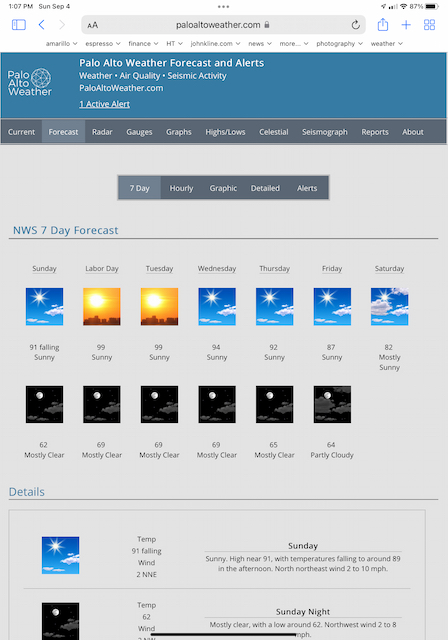

# weewx-nws
*Open source plugin for WeeWX software.

## Description

A WeeWX extension for NWS forecasts.

Copyright (C)2020-2024 by John A Kline (john@johnkline.com)

**This plugin requires Python 3.7, WeeWX 4 or 5**

**If you are updating from versions less than 4.1, you MUST delete the nws database (nws.sdb) before
  restarting weewx.  This is because the database schema has changed.  If you don't do this, nws
  won't work and the following statement will be in the weewx log:
  ERROR user.nws: You must delete the nws.sdb database and restart weewx.  It contains an old schema!
  Note: There will also be other nws errors in the log. **

# Installation Instructions

## WeeWX 5 Installation Instructions

1. If pip install:
   Activate the virtual environment (actual syntax varies by type of WeeWX install):
   `/home/weewx/weewx-venv/bin/activate`
   Install the dateutil package.
   `pip install python-dateutil`
   Install the requests package.
   `pip install requests`

1. If package install:
   Install dateutil for python3 (it is required by the nws extension).
   On debian, this can be accomplished with:
   ```
   sudo apt install python3-dateutil
   ```
   Install python3's requests package.
   On debian, this can be accomplished with:
   ```
   apt install python3-requests
   ```

1. Download the release from the [github](https://github.com/chaunceygardiner/weewx-nws).
   Click on releases and pick the latest release (Release v4.5.3).

1. Install the nws extension.

   `weectl extension install weewx-nws-4.5.3.zip`

## WeeWX 4 Installation Instructions

1. Install dateutil for python3 (it is required by the nws extension).
   On debian, this can be accomplished with:
   ```
   sudo apt install python3-dateutil
   ```

1. Install python3's requests package.
   On debian, this can be accomplished with:
   ```
   apt install python3-requests
   ```

1. Download the release from the [github](https://github.com/chaunceygardiner/weewx-nws).
   Click on releases and pick the latest release (Release v4.5.3).

1. Run the following command.
   ```
   sudo /home/weewx/bin/wee_extension --install weewx-nws-4.5.3.zip
   ```
   Note: The above command assumes a WeeWX installation of `/home/weewx`.
         Adjust the command as necessary.

# Configuring weewx-nws

1. weewx-nws is designed to work with no configuration, but it is best to update the
   user agent being used to contact NWS.  This is per NWS rules about using the API.
   To do that, edit weewx.conf and fill in User-Agent with your weather site and contact
   information.
   ```
   [NWS]
       User-Agent = "(my-weather-site.com, me@my-weather-site.com)"
   ```

1. Best pratice is to let weewx-nws pick up your station's latitude an longtitude from
   the Station section in weewx.conf.  If one has a need to override the lat/long, it
   can be set in the NWS section as follows:
   ```
   [NWS]
       latitude = 37.431995  # Best practice is not to set latitude here.
       longitude = -122.333  # Best practice is not to set longitude here.
   ```

1. **As of 15 March 2023, this NWS bug is fixed (at least for the author's location).
   If you have hardcoded your URLs and are now getting the error listed below, it is because
   NWS has fixed the problem for you area.  Simply remove the hardcoded URLs in the NWS
   section of weewx.conf.**

   If NWS is returning the wrong grid for your lat/long (as is the case for the author),
   the twelve hour and one hour forecast URLs can be hardcoded with the correct grid
   with the `one_hour_forecast_url` and `twelve_hour_forecast_url`.
   For example, using Lat/Long 37.431495/-122.110937, you'll see a message in the log:
   "WARNING user.nws: Lat/Long 37.431495/-122.110937 does not fall within bounds of forecast's polygon (due to NWS Bug)."
   Your grid is off by (1,1).  In this example, you'll see in the log that the grid being called is 92,88.
   ```
   INFO user.nws: Downloading ForecastType.TWELVE_HOUR forecasts from https://api.weather.gov/gridpoints/MTR/91,87/forecast.
   INFO user.nws: Downloading ForecastType.ONE_HOUR forecasts from https://api.weather.gov/gridpoints/MTR/92,88/forecast/hourly.
   ```
   It should be 91,87.  As such, add the following lines to the NWS section of weewx.conf:
   ```
   [NWS]
       twelve_hour_forecast_url = "https://api.weather.gov/gridpoints/MTR/91,87/forecast"
       one_hour_forecast_url = "https://api.weather.gov/gridpoints/MTR/91,87/forecast/hourly"
   ```

   There is now a utility included with the plugin that one can run to figure out if NWS returns the correct
   grid; and, if not, it prints the lines to add to the NWS section in order to get the correct grid.
   Following is a sample run of that utility.  Of course, you'll need to use the latitude and longitude
   of your station, as specified in the weewx.conf file.  Also, please note, you'll need to install
   matplotlib to run this utility.  Matplotlib is NOT needed to run the extension.  On Debian systems,
   matlotlib can be installed with:
   **Note: As of 15 March 2023, the following example reports no issue as NWS has rolled out a fix (at least for this location).**
   ```
   sudo apt install python3-matplotlib
   ```
   A sample sesion of the check_grid utility follows:
   ```
   $ ./check_grid.py --latitude 37.431495 --longitude -122.110937
   nws computed the incorrect grid(92, 88) for lat/long 37.431495/-122.110937

   Add the following two lines to the [NWS] section in weewx.conf:
       twelve_hour_forecast_url = "https://api.weather.gov/gridpoints/MTR/91,87/forecast"
       one_hour_forecast_url = "https://api.weather.gov/gridpoints/MTR/91,87/forecast/hourly"
   ```

1. By default, nws will keep 9 days of forecasts.  One can change this in weewx.conf.
   Set days_to_keep to zero to keep all forecasts.  Although this is configurable, keeping
   a large number of days will slow things down.
   Note: Alerts are deleted when they expire.  As such, days_to_keep has no affect on alerts.
   ```
   [NWS]
    days_to_keep = 9  # Set to zero to never delete any forecasts and alerts.
   ```

1. Add NWSForecastVariables to each report that you want to have access to forecasts and alerts.

   For example, to enable in the SeasonsReport, edit weewx.conf to add user.nws.NWSForecastVariables
   in search_list_extensions.  Note: you might need to add both the CheetahGenerator line and the
   search_list_extensions line (if they do no already exist).
   ```
    [StdReport]
        [[SeasonsReport]]
            [[[CheetahGenerator]]]
                search_list_extensions = user.nws.NWSForecastVariables
   ```

1. If you are moving from a version prior to 2.0, YOU MUST DELETE the nws database.
    ```
    sudo rm /var/lib/weewx/nws.sdb
    ```
    or
    ```
    sudo rm /home/weewx/archive/nws.sdb
    ```
    Note: The first example above is the most likely location of nws.sdb.
          The second example is if you installed weewx via the setup.py method.
          Of course, the nws.sdb database could be elsewhere.

1. Restart WeeWX.

1. After the next reporting cycle, navigate to <weewx-html-directory>/nws to see forecasts in the sample report.

1.  To get twelve-hour forecasts (in this example, all forecasts are returned (usually 13, 6.5 days)
    ```
     #for $twelve_hour in $nwsforecast.twelve_hour_forecasts()  # twelve_hour_forecasts(4) will return 4 forecasts.
         $twelve_hour.generatedTime
         $twelve_hour.number
         $twelve_hour.name
         $twelve_hour.startTime
         $twelve_hour.endTime
         $twelve_hour.isDaytime
         $twelve_hour.outTemp
         $twelve_hour.outTempTrend (bay be none)
         $twelve_hour.windSpeed
         $twelve_hour.windSpeed2 (may be None)
         $twelve_hour.windDir
         $twelve_hour.iconUrl
         $twelve_hour.shortForecast
         $twelve_hour.detailedForecast
         $twelve_hour.latitude    # Latitude of point for which forecasts were requested
         $twelve_hour.longitude   # Longitude of point for which forecasts were requested
     #end for
    ```
    Sample values for the above variables follow:
    ```
    $twelve_hour.gneratedTime    : 2020-06-08 15:25:13 PDT (1591655113)
    $twelve_hour.number          : 14
    $twelve_hour.name            : Sunday Night
    $twelve_hour.startTime       : 2020-06-14 18:00:00 PDT (1592182800)
    $twelve_hour.endTime         : 2020-06-15 06:00:00 PDT (1592226000)
    $twelve_hour.isDaytime       : 0
    $twelve_hour.outTemp         : 58.000000
    $twelve_hour.outTempTrend    : None
    $twelve_hour.windSpeed       : 2.000000
    $twelve_hour.windSpeed2      : 9.000000
    $twelve_hour.windDir         : 292.500000
    $twelve_hour.iconUrl         : https://api.weather.gov/icons/land/night/few?size=medium
    $twelve_hour.shortForecast   : Mostly Clear
    $twelve_hour.detailedForecast: Mostly clear, with a low around 58.
    $twelve_hour.latitude        : 37.431495
    $twelve_hour.longitude       : -122.110937
    ```
    Twelve-hour forecasts can be seen in action on the **7 Day** tab at [www.paloaltoweather.com/forecast.html](https://www.paloaltoweather.com/forecast.html).
    The code for this page (at the time of this writing) is:
    ```
       #for $twelve_hour in $nwsforecast.twelve_hour_forecasts()
       <tr>
         <td>
           <table style='width:100%;border-bottom:1pt solid LightGray;padding:15px;'>
             #set icon = $twelve_hour.iconUrl
             #if $target_display == 'smartphone':
               ## Change ?size=medium to ?size=large
               #set icon = $icon.replace('?size=medium', '?size=large')
             #end if
             <td style='width:16%;'></td>
             <td style='width:30%;'>
               <table style='width:100%;text-align:center;'>
                 <tr style='width:100%;'><td>Temp</td></tr>
                 <tr style='width:100%;'><td>$twelve_hour.outTemp $twelve_hour.outTempTrend </td></tr>
                 <tr style='width:100%;'><td>Wind</td></tr>
                 #if $twelve_hour.windSpeed2 is None
                   <tr style='width:100%;'><td>$twelve_hour.windSpeed.format('%.0f')$unit.label.windSpeed $twelve_hour.windDir.ordinal_compass</td></tr>
                 #else
                   <tr style='width:100%;'><td>$twelve_hour.windSpeed.format('%.0f') to $twelve_hour.windSpeed2.format('%.0f')$unit.label.windSpeed $twelve_hour.windDir.ordinal_compass</td></tr>
                 #end if
               </table>
             </td>
             <td style='width:54%;'>
               <table style='width:100%;text-align:center;'>
                 <tr style='width:100%;'><td style='text-align:center;font-size:$title_font_size;font-weight:bold;border-bottom:1pt solid LightGray;'>$twelve_hour.name</td></tr>
                 <tr style='width:100%;'><td>$twelve_hour.detailedForecast</td></tr>
               </table>
             </td>
           </table>
         </td>
       </tr>
       #end for
    ```
    A screenshot follows:

    

1.  To get one-hour forecasts (in this example, up to 156 foreecasts are returned (6.5 days worth).
    ```
    #for $hour in $nwsforecast.one_hour_forecasts() # Note: one_hour_forecasts(24) will return 24 forecassts (1 day).
         $hour.generatedTime
         $hour.number
         $hour.name             ## Empty for one_hour_forecasts
         $hour.startTime
         $hour.endTime
         $hour.isDaytime
         $hour.outTemp
         $hour.outTempTrend (may be None)
         $hour.pop
         $hour.dewpoint
         $hour.outHumidity
         $hour.windSpeed
         $hour.windSpeed2 (currently always None)
         $hour.windDir
         $hour.iconUrl
         $hour.shortForecast
         $hour.detailedForecast ## Empty for one_hour_forecasts
         $hour.latitude    # Latitude of point for which forecasts were requested
         $hour.longitude   # Longitude of point for which forecasts were requested
    #end for
    ```
    Sample values for the above variables follow:
    ```
    $hour.dateTime        : 2020-06-09 04:30:00 PDT (1591702200)
    $hour.interval        : 60
    $hour.latitude        : 37.431495
    $hour.longitude       : -122.110937
    $hour.usUnits         : 1
    $hour.gneratedTime    : 2020-06-09 04:01:35 PDT (1591700495)
    $hour.number          : 156
    $hour.name            :
    $hour.startTime       : 2020-06-15 15:00:00 PDT (1592258400)
    $hour.endTime         : 2020-06-15 16:00:00 PDT (1592262000)
    $hour.isDaytime       : 1
    $hour.outTemp         : 81.000000
    $hour.outTempTrend    : None
    $hour.pop             : 0
    $hour.dewpoint        : 51.0
    $hour.outHumidity     : 79
    $hour.windSpeed       : 10.000000
    $hour.windSpeed2      : None
    $hour.windDir         : 292.500000
    $hour.iconUrl         : https://api.weather.gov/icons/land/day/few?size=small
    $hour.shortForecast   : Sunny
    $hour.detailedForecast:
    $hour.latitude        : 37.431495
    $hour.longitude       : -122.110937
    ```
    One-hour forecasts can be seen in action on the **Hourly** tab at [www.paloaltoweather.com/forecast.html](https://www.paloaltoweather.com/forecast.html).
    The code for this page (at the time of this writing) is:
    ```
       #for $hour in $nwsforecast.one_hour_forecasts(72)
       <tr class='forecast_hours'>
         #set icon = $hour.iconUrl
         #if $target_display == 'smartphone':
           ## Change ?size=small to ?size=medium
           #set icon = $icon.replace('?size=small', '?size=medium')
         #end if
         <td></td>
         <td>$hour.startTime.format('%a %l %p')</td>
         <td>$hour.shortForecast</td>
         <td>$hour.outTemp</td>
         <td>$hour.windSpeed $hour.windDir.ordinal_compass</td>
       </tr>
       #end for
    ```
    A screenshot follows:

    

1.  To get all alerts for the station's location:
    ```
    #for $alert in $nwsforecast.alerts()
         $alert.id           # Identifier (ID) of alert
         $alert.effective    # Time issued
         $alert.expires      # Time this alert expires
         $alert.onset        # Time it will begin
         $alert.ends         # Time it will end
         $alert.event        # Name of event (e.g., Heat Advisory)
         $alert.headline     # Headline
         $alert.nwsHeadline  # NWSheadline
         $alert.description  # Long description
         $alert.instructions # Instructions on what to do
         $alert.latitude     # Latitude of point for which alerts were requested
         $alert.longitude    # Longitude of point for which alerts were requested
         $alert.sent         # Time alert was sent.
         $alert.status       # Status of alert (e.g., Actual)
         $alert.messageType  # Message type (e.g., Update)
         $alert.category     # Category (e.g., Met)
         $alert.severity     # Severity (e.g, Moderate)
         $alert.certainty    # Certainty (e.g, Likely)
         $alert.urgency      # Urgency (e.g, Expected)
         $alert.sender       # Sender (e.g, w-nws.webmaster@noaa.gov)
         $alert.senderName   # Name of Sender (e.g, NWS San Francisco CA)
    #end for
    ```
    Sample values for the above variables follow:
    ```
    id          : urn:oid:2.49.0.1.840.0.196e527647de415857d1e754a00bd7214fbe8828.002.1
    effective   : 04-Sep-2022 04:11
    expires     : 04-Sep-2022 15:00
    onset       : 04-Sep-2022 11:00
    ends        : 06-Sep-2022 20:00
    event       : Heat Advisory
    headline    : Heat Advisory issued September 4 at 4:11AM PDT until September 6 at 8:00PM PDT by NWS San Francisco CA
    nwsHeadline : HEAT ADVISORY IN EFFECT FROM 4 AM SUNDAY TO 8 PM PDT TUESDAY
    description : * WHAT...Temperatures up to 98 expected.<br/>* WHERE...Marin Coastal Range...
    instructions: Drink plenty of fluids, stay in an air-conditioned room, stay out of the sun...
    latitude    : 37.431495
    longitude   : -122.110937
    sent        : 04-Sep-2022 04:11
    status      : Actual
    messageType : Update
    category    : Met
    severity    : Moderate
    certainty   : Likely
    urgency     : Expected
    sender      : w-nws.webmaster@noaa.gov
    senderName  : NWS San Francisco CA
    ```
    Alerts can be seen in action on the **Alerts** tab at [www.paloaltoweather.com/forecast.html](https://www.paloaltoweather.com/forecast.html).
    The code for this page (at the time of this writing) is:
    ```
    <table style='border-style:solid;padding:30px;border:1pt solid #aaaaaa;'>
      #if $target_display == 'desktop'
        #set $title_font_size = 'large'
      #else
        #set $title_font_size = '46px'
      #end if
      #set $alert_count = 0
      #for $alert in $nwsforecast.alerts()
      #set $alert_count += 1
      <tr style='width:100%;'><td style='text-align:center;font-size:$title_font_size;font-weight:bold;border-bottom:2pt solid Black;'>$alert.nwsHeadline</td></tr>
      <tr><td style='text-align:left;'><br/>Status: $alert.status</td></tr>
      <tr><td style='text-align:left;'>Severity: $alert.severity</td></tr>
      <tr><td style='text-align:left;'>Certainty: $alert.certainty</td></tr>
      #try
        #set $desc = $alert.description.replace('\n\n', '<br/>')
        #set $desc = $desc.replace('\n', ' ')
      #except
        ## Calling replace has failed because of malformed alerts.
        ## alert.description is probably None
        #set $desc = $alert.description
      #end try
      <tr>
        <td style='text-align:left;'>
          <br/>
          $desc
        </td>
      </tr>
      <tr>
        <td style='text-align:left;'>
          <br/>
          Instructions: $alert.instructions
        </td>
      </tr>
      <tr><td style='text-align:left;'><br/>ID: $alert.id</td></tr>
      <tr><td style='text-align:left;'>Event: $alert.event</td></tr>
      <tr><td style='text-align:left;'>Issued: $alert.effective</td></tr>
      <tr><td style='text-align:left;'>Expires: $alert.expires</td></tr>
      <tr><td style='text-align:left;'>Onset: $alert.onset</td></tr>
      <tr><td style='text-align:left;'>Ends: $alert.ends</td></tr>
      <tr><td style='text-align:left;'>Sent: $alert.sent</td></tr>
      <tr><td style='text-align:left;'>Message Type: $alert.messageType</td></tr>
      <tr><td style='text-align:left;'>Category: $alert.category</td></tr>
      <tr><td style='text-align:left;'>Urgency: $alert.urgency</td></tr>
      <tr><td style='text-align:left;'>Sender: $alert.sender</td></tr>
      <tr><td style='text-align:left;'>Sender Name: $alert.senderName<br/><br/></td></tr>
      #end for
      #if $alert_count == 0
        <tr><td style='text-align:center;font-weight:bold;font-style:italic'>No active National Weather Service alerts for this location.</td></tr>
      #end if
    </table>
    ```
    A screenshot follows:

    

1.  alert_count() is a convenience function to get the number of active alerts
    that apply to your station.  The code to show an active alert count follows:
    ```
       #set alert_count = $nwsforecast.alert_count()
       #if $alert_count > 0
         #if $alert_count == 1
           #set alert_word = 'Alert'
         #else
           #set alert_word = 'Alerts'
         #end if
         <p><a href='forecast.html?tab=alerts' style='font-size:19px;color:black;text-decoration:underline;'>$alert_count Active $alert_word</a></p>
       #end if
    ```

## Troubleshooting

1.  Did you forget to add NWSForecastVariables to your report in weewx.conf?  See step 1 in the **How to access NWS Forecasts in reports.** section.

1.  The extension can be run from the command line to test:

    1. To test requesting forecasts from NWS:
       ```
       PYTHONPATH=/home/weewx/bin python3 /home/weewx/bin/user/nws.py --test-requester --type TWELVE_HOUR --latitude 38.8977 --longitude -77.0365

    1. To test the service as a whole, requesting and saving to a [temporary] sqlite database:
       ```
       PYTHONPATH=/home/weewx/bin python3 /home/weewx/bin/user/nws.py --test-service --latitude 38.8977 --longitude -77.0365
       ```

    1. To view the latest forecast records in the databse (only works for sqlite databases):
       ```
       PYTHONPATH=/home/weewx/bin python3 /home/weewx/bin/user/nws.py --view-forecasts --type ONE_HOUR --nws-database /home/weewx/archive/nws.sdb --view-criterion LATEST --latitude 38.8977 --longitude -77.0365

    1. To view all forecast records in the databse (only works for sqlite databases):
       ```
       PYTHONPATH=/home/weewx/bin python3 /home/weewx/bin/user/nws.py --view-forecasts --type TWELVE_HOUR --nws-database /home/weewx/archive/nws.sdb --view-criterion ALL --latitude 38.8977 --longitude -77.0365
       ```
       ```

    1. To view a summary of forecasts in the database (time inserted, time generated, start/end of forecast) (only works for sqlite databases):
       ```
       PYTHONPATH=/home/weewx/bin python3 /home/weewx/bin/user/nws.py --view-forecasts --type ONE_HOUR --nws-database /home/weewx/archive/nws.sdb --view-criterion SUMMARY --latitude 38.8977 --longitude -77.0365
       ```
       ```
       PYTHONPATH=/home/weewx/bin python3 /home/weewx/bin/user/nws.py --view-forecasts --type TWELVE_HOUR --nws-database /home/weewx/archive/nws.sdb --view-criterion SUMMARY --latitude 38.8977 --longitude -77.0365
       ```

    1. To see all options:
       ```
       PYTHONPATH=/home/weewx/bin python3 /home/weewx/bin/user/nws.py --help
       ```

## Licensing

weewx-nws is licensed under the GNU Public License v3.
