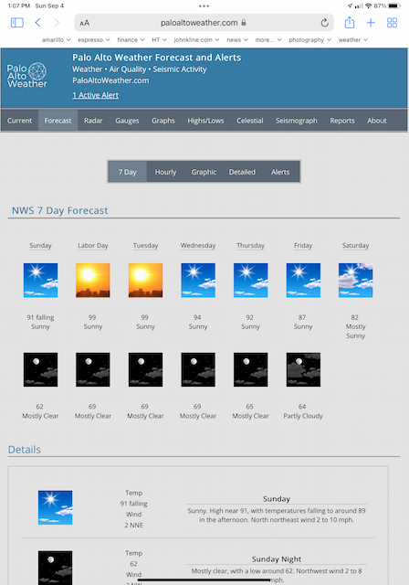
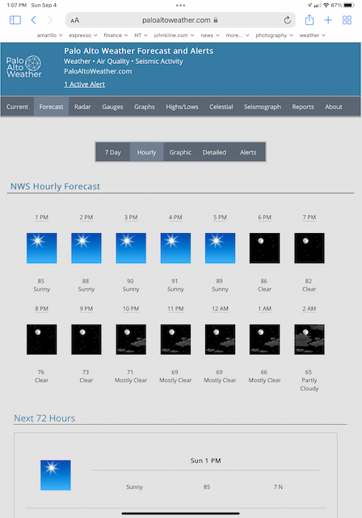
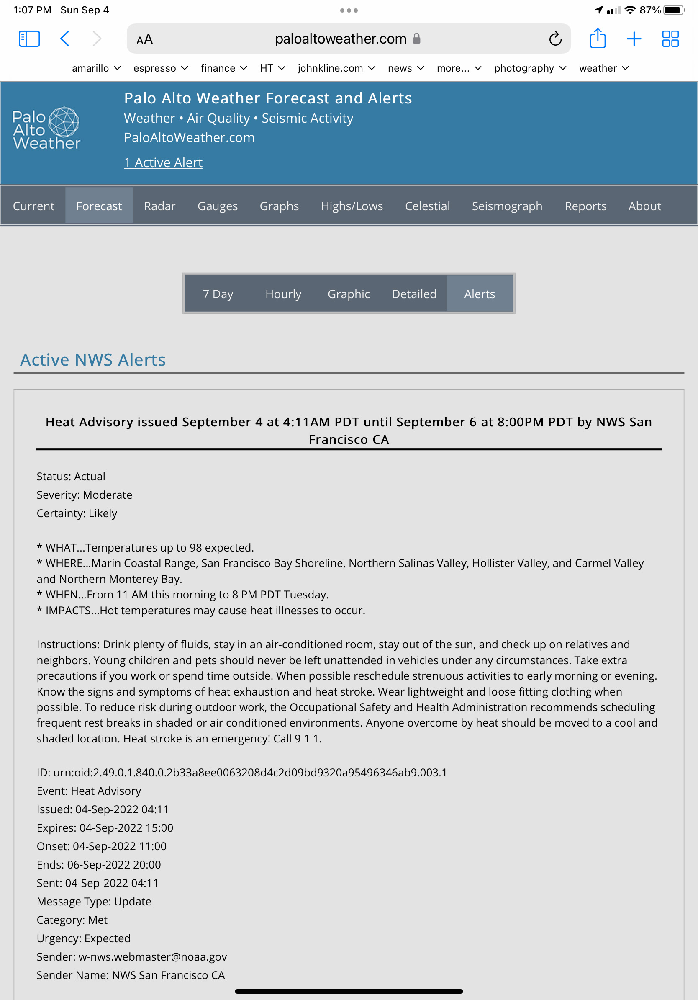

# weewx-nws

*Open source plugin for WeeWX software.*

## Description

A WeeWX extension that fetches National Weather Service forecasts and alerts for the
station's location:

* **Twelve-hour forecasts** — daytime and nighttime periods, 6.5 days out.
* **One-hour forecasts** — hourly periods, 6.5 days (156 hours) out.
* **Active alerts** — e.g., Heat Advisory, Red Flag Warning, with the full alert text.

The extension polls api.weather.gov in the background (by default, forecasts every 30
minutes and alerts every 10 minutes), saves the results to its own database (`nws.sdb`),
and makes them available to every report as `$nwsforecast` tags (see
[How to access NWS forecasts in reports](#how-to-access-nws-forecasts-in-reports)).
It also installs a sample report (`NWSReport`) that publishes forecast and alert pages,
including weather icons, to `<HTML_ROOT>/nws/` — so forecasts appear on your site at the
first report cycle after install, before you write a single line of template code.

To see weewx-nws in action, check the forecast page at
[www.paloaltoweather.com/forecast.html](https://www.paloaltoweather.com/forecast.html).

Copyright (C)2020-2026 by John A Kline (john@johnkline.com)

**This plugin requires Python 3.9 or later, WeeWX 5, and the python `requests` and
`dateutil` packages (installing them is covered in the installation instructions
below).  WeeWX 4 users: weewx-nws 4.5.7 was the last release to support WeeWX 4.**

**If you are updating from versions less than 4.5.4, you MUST delete the nws database (nws.sdb) before
  restarting weewx.  This is because the database schema has changed.**

# Installation Instructions

1. If pip install:
   Activate the virtual environment (actual path varies by type of WeeWX install):
   ```
   source /home/weewx/weewx-venv/bin/activate
   ```
   Install the dateutil package.
   ```
   pip install python-dateutil
   ```
   Install the requests package.
   ```
   pip install requests
   ```

1. If package install:
   Install dateutil for python3 (it is required by the nws extension).
   On debian, this can be accomplished with:
   ```
   sudo apt install python3-dateutil
   ```
   Install python3's requests package.
   On debian, this can be accomplished with:
   ```
   sudo apt install python3-requests
   ```

1. Download the [latest release from GitHub](https://github.com/chaunceygardiner/weewx-nws/releases/download/latest/weewx-nws.zip).

1. Install the nws extension (for a package install, as root: `sudo weectl ...`).

   `weectl extension install weewx-nws.zip`

# Configuring weewx-nws

1. weewx-nws is designed to work with no configuration, but it is best to update the
   user agent being used to contact NWS.  This is per NWS rules about using the API.
   To do that, edit weewx.conf and fill in User-Agent with your weather site and contact
   information.
   ```
   [NWS]
       User-Agent = "(my-weather-site.com, me@my-weather-site.com)"
   ```

1. Best practice is to let weewx-nws pick up your station's latitude and longitude from
   the Station section in weewx.conf.  If one has a need to override the lat/long, it
   can be set in the NWS section as follows:
   ```
   [NWS]
       latitude = 37.431995  # Best practice is not to set latitude here.
       longitude = -122.333  # Best practice is not to set longitude here.
   ```

1. **As of 15 March 2023, this NWS bug is fixed (at least for the author's location).
   If you have hardcoded your URLs and are now getting the error listed below, it is because
   NWS has fixed the problem for you area.  Simply remove the hardcoded URLs in the NWS
   section of weewx.conf.**

   If NWS is returning the wrong grid for your lat/long (as is the case for the author),
   the twelve hour and one hour forecast URLs can be hardcoded with the correct grid
   with the `one_hour_forecast_url` and `twelve_hour_forecast_url`.
   For example, using Lat/Long 37.431495/-122.110937, you'll see a message in the log:
   "WARNING user.nws: Lat/Long 37.431495/-122.110937 does not fall within bounds of forecast's polygon (due to NWS Bug)."
   Your grid is off by (1,1).  In this example, you'll see in the log that the grid being called is 92,88.
   ```
   INFO user.nws: Downloading ForecastType.TWELVE_HOUR forecasts from https://api.weather.gov/gridpoints/MTR/91,87/forecast.
   INFO user.nws: Downloading ForecastType.ONE_HOUR forecasts from https://api.weather.gov/gridpoints/MTR/92,88/forecast/hourly.
   ```
   It should be 91,87.  As such, add the following lines to the NWS section of weewx.conf:
   ```
   [NWS]
       twelve_hour_forecast_url = "https://api.weather.gov/gridpoints/MTR/91,87/forecast"
       one_hour_forecast_url = "https://api.weather.gov/gridpoints/MTR/91,87/forecast/hourly"
   ```

   There is a utility built into the extension (as of version 5.0, it is the `--check-grid`
   option of nws.py; the separate check_grid.py utility, which required matplotlib, has been
   removed) that one can run to figure out if NWS returns the correct grid; and, if not, it
   prints the lines to add to the NWS section in order to get the correct grid.  Following is
   a sample run of that utility.  Of course, you'll need to use the latitude and longitude of
   your station, as specified in the weewx.conf file, and the python in which WeeWX is
   installed (for a pip install, activate WeeWX's virtual environment).
   **Note: As of 15 March 2023, the following example reports no issue as NWS has rolled out a fix (at least for this location).**
   ```
   $ python /home/weewx/bin/user/nws.py --check-grid --latitude 37.431495 --longitude -122.110937
   nws computed the incorrect grid(92, 88) for lat/long 37.431495/-122.110937

   Add the following two lines to the [NWS] section in weewx.conf:
       twelve_hour_forecast_url = "https://api.weather.gov/gridpoints/MTR/91,87/forecast"
       one_hour_forecast_url = "https://api.weather.gov/gridpoints/MTR/91,87/forecast/hourly"
   ```

1. By default, nws will keep 9 days of forecasts.  One can change this in weewx.conf.
   Set days_to_keep to zero to keep all forecasts.  Although this is configurable, keeping
   a large number of days will slow things down.
   Note: Alerts are deleted when they expire.  As such, days_to_keep has no effect on alerts.
   ```
   [NWS]
       days_to_keep = 9  # Set to zero to never delete any forecasts.
   ```

1. Add NWSForecastVariables to each report that you want to have access to forecasts and alerts.

   For example, to enable in the SeasonsReport, edit weewx.conf to add user.nws.NWSForecastVariables
   in search_list_extensions.  Note: you might need to add both the CheetahGenerator line and the
   search_list_extensions line (if they do not already exist).
   ```
    [StdReport]
        [[SeasonsReport]]
            [[[CheetahGenerator]]]
                search_list_extensions = user.nws.NWSForecastVariables
   ```

1. If you are moving from a version prior to 2.0, YOU MUST DELETE the nws database.
    ```
    sudo rm /var/lib/weewx/nws.sdb
    ```
    or
    ```
    sudo rm /home/weewx/archive/nws.sdb
    ```
    Note: The first example above is the most likely location of nws.sdb.
          The second example is if you installed weewx via the setup.py method.
          Of course, the nws.sdb database could be elsewhere.

1. Restart WeeWX.

1. After the next reporting cycle, navigate to <weewx-html-directory>/nws to see the
   sample report (twelve-hour forecasts on the days page, one-hour forecasts on the
   hours page, plus an alerts page).

# Configuration reference

All options for the `[NWS]` section of weewx.conf follow, with their defaults.  The
install seeds this section; in normal use, only `User-Agent` needs to be changed.

```
[NWS]
    # Contact information identifying you to NWS, sent on every request.
    # NWS's API rules ask that this identify your site and give a contact address.
    User-Agent = '(my-weather-site.com, me@my-weather-site.com)'

    # The data binding to use for the forecast database.  The install also seeds
    # the matching nws_binding/nws_sqlite entries under [DataBindings] and
    # [Databases]; there is no reason to change any of this.
    data_binding = nws_binding

    # Days of old forecasts to keep in the database (0 = keep forever).  Expired
    # alerts are always deleted, regardless of this setting.
    days_to_keep = 9

    # Seconds between requests for forecasts (twelve-hour and one-hour).  Polls
    # align to the wall clock: 1800 polls on the hour and half hour.
    poll_secs = 1800

    # Seconds between requests for alerts.  Alerts are polled more often than
    # forecasts because they are time critical.
    alert_poll_secs = 600

    # Seconds to wait before retrying after repeated failures (forecasts/alerts).
    # Transient failures are first retried a few times, seconds apart; these
    # values govern the wait once NWS looks to be down.
    retry_wait_secs = 300
    alert_retry_wait_secs = 30

    # Seconds before an HTTP request to NWS times out.
    timeout_secs = 10

    # Override the station location from [Station].  Best practice is NOT to set
    # these; see the configuration steps above.
    #latitude = 37.431495
    #longitude = -122.110937

    # Hard code the gridpoint forecast URLs.  Only needed if NWS maps your
    # lat/long to the wrong gridpoint; see the --check-grid instructions above.
    #twelve_hour_forecast_url = "https://api.weather.gov/gridpoints/MTR/91,87/forecast"
    #one_hour_forecast_url = "https://api.weather.gov/gridpoints/MTR/91,87/forecast/hourly"

    # ADVANCED: If set, read forecasts from files named ONE_HOUR, TWELVE_HOUR and
    # ALERTS in this directory (when present) instead of contacting NWS.  The only
    # reason to use read_from_dir/RsyncSpec is a fleet of machines all pulling
    # forecasts and alerts for the exact same location: one machine contacts NWS
    # and the rest read files, so the fleet doesn't hammer NWS's servers (and
    # risk being blacklisted).
    #read_from_dir = /root/forecasts

    # ADVANCED: The other half of read_from_dir.  On the one machine that does
    # contact NWS, scp each downloaded batch of alerts (alerts only -- they are
    # the time-critical type) to the read_from_dir of the client machines.
    #[[RsyncSpec]]
    #    enable = false
    #    remote_clients = client1, client2
    #    remote_user = root
    #    remote_dir = /root/forecasts
    #    compress = false
    #    log_success = false
    #    ssh_options = -o ConnectTimeout=1
    #    timeout = 1
```

# How to access NWS forecasts in reports

1.  To get twelve-hour forecasts (in this example, all forecasts are returned — usually 14, covering 6.5 days):
    ```
     #for $twelve_hour in $nwsforecast.twelve_hour_forecasts()  # twelve_hour_forecasts(4) will return 4 forecasts.
         $twelve_hour.generatedTime
         $twelve_hour.number
         $twelve_hour.name
         $twelve_hour.startTime
         $twelve_hour.endTime
         $twelve_hour.isDaytime
         $twelve_hour.outTemp
         $twelve_hour.outTempTrend (may be None)
         $twelve_hour.windSpeed
         $twelve_hour.windSpeed2 (may be None)
         $twelve_hour.windDir
         $twelve_hour.iconUrl
         $twelve_hour.shortForecast
         $twelve_hour.detailedForecast
         $twelve_hour.latitude    # Latitude of point for which forecasts were requested
         $twelve_hour.longitude   # Longitude of point for which forecasts were requested
     #end for
    ```
    Sample values for the above variables follow:
    ```
    $twelve_hour.generatedTime   : 2020-06-08 15:25:13 PDT (1591655113)
    $twelve_hour.number          : 14
    $twelve_hour.name            : Sunday Night
    $twelve_hour.startTime       : 2020-06-14 18:00:00 PDT (1592182800)
    $twelve_hour.endTime         : 2020-06-15 06:00:00 PDT (1592226000)
    $twelve_hour.isDaytime       : 0
    $twelve_hour.outTemp         : 58.000000
    $twelve_hour.outTempTrend    : None
    $twelve_hour.windSpeed       : 2.000000
    $twelve_hour.windSpeed2      : 9.000000
    $twelve_hour.windDir         : 292.500000
    $twelve_hour.iconUrl         : https://api.weather.gov/icons/land/night/few?size=medium
    $twelve_hour.shortForecast   : Mostly Clear
    $twelve_hour.detailedForecast: Mostly clear, with a low around 58.
    $twelve_hour.latitude        : 37.431495
    $twelve_hour.longitude       : -122.110937
    ```
    Twelve-hour forecasts can be seen in action on the **7 Day** tab at [www.paloaltoweather.com/forecast.html](https://www.paloaltoweather.com/forecast.html).
    The code for this page (at the time of this writing) is:
    ```
       #for $twelve_hour in $nwsforecast.twelve_hour_forecasts()
       <tr>
         <td>
           <table style='width:100%;border-bottom:1pt solid LightGray;padding:15px;'>
             #set icon = $twelve_hour.iconUrl
             #if $target_display == 'smartphone':
               ## Change ?size=medium to ?size=large
               #set icon = $icon.replace('?size=medium', '?size=large')
             #end if
             <td style='width:16%;'></td>
             <td style='width:30%;'>
               <table style='width:100%;text-align:center;'>
                 <tr style='width:100%;'><td>Temp</td></tr>
                 <tr style='width:100%;'><td>$twelve_hour.outTemp $twelve_hour.outTempTrend </td></tr>
                 <tr style='width:100%;'><td>Wind</td></tr>
                 #if $twelve_hour.windSpeed2 is None
                   <tr style='width:100%;'><td>$twelve_hour.windSpeed.format('%.0f')$unit.label.windSpeed $twelve_hour.windDir.ordinal_compass</td></tr>
                 #else
                   <tr style='width:100%;'><td>$twelve_hour.windSpeed.format('%.0f') to $twelve_hour.windSpeed2.format('%.0f')$unit.label.windSpeed $twelve_hour.windDir.ordinal_compass</td></tr>
                 #end if
               </table>
             </td>
             <td style='width:54%;'>
               <table style='width:100%;text-align:center;'>
                 <tr style='width:100%;'><td style='text-align:center;font-size:$title_font_size;font-weight:bold;border-bottom:1pt solid LightGray;'>$twelve_hour.name</td></tr>
                 <tr style='width:100%;'><td>$twelve_hour.detailedForecast</td></tr>
               </table>
             </td>
           </table>
         </td>
       </tr>
       #end for
    ```
    A screenshot follows:

    

1.  To get one-hour forecasts (in this example, up to 156 forecasts are returned — 6.5 days worth):
    ```
    #for $hour in $nwsforecast.one_hour_forecasts() # Note: one_hour_forecasts(24) will return 24 forecasts (1 day).
         $hour.generatedTime
         $hour.number
         $hour.name             ## Empty for one_hour_forecasts
         $hour.startTime
         $hour.endTime
         $hour.isDaytime
         $hour.outTemp
         $hour.outTempTrend (may be None)
         $hour.pop
         $hour.dewpoint
         $hour.outHumidity
         $hour.windSpeed
         $hour.windSpeed2 (currently always None)
         $hour.windDir
         $hour.iconUrl
         $hour.shortForecast
         $hour.detailedForecast ## Empty for one_hour_forecasts
         $hour.latitude    # Latitude of point for which forecasts were requested
         $hour.longitude   # Longitude of point for which forecasts were requested
    #end for
    ```
    Sample values for the above variables follow:
    ```
    $hour.dateTime        : 2020-06-09 04:30:00 PDT (1591702200)
    $hour.interval        : 60
    $hour.latitude        : 37.431495
    $hour.longitude       : -122.110937
    $hour.usUnits         : 1
    $hour.generatedTime   : 2020-06-09 04:01:35 PDT (1591700495)
    $hour.number          : 156
    $hour.name            :
    $hour.startTime       : 2020-06-15 15:00:00 PDT (1592258400)
    $hour.endTime         : 2020-06-15 16:00:00 PDT (1592262000)
    $hour.isDaytime       : 1
    $hour.outTemp         : 81.000000
    $hour.outTempTrend    : None
    $hour.pop             : 0
    $hour.dewpoint        : 51.0
    $hour.outHumidity     : 79
    $hour.windSpeed       : 10.000000
    $hour.windSpeed2      : None
    $hour.windDir         : 292.500000
    $hour.iconUrl         : https://api.weather.gov/icons/land/day/few?size=small
    $hour.shortForecast   : Sunny
    $hour.detailedForecast:
    $hour.latitude        : 37.431495
    $hour.longitude       : -122.110937
    ```
    One-hour forecasts can be seen in action on the **Hourly** tab at [www.paloaltoweather.com/forecast.html](https://www.paloaltoweather.com/forecast.html).
    The code for this page (at the time of this writing) is:
    ```
       #for $hour in $nwsforecast.one_hour_forecasts(72)
       <tr class='forecast_hours'>
         #set icon = $hour.iconUrl
         #if $target_display == 'smartphone':
           ## Change ?size=small to ?size=medium
           #set icon = $icon.replace('?size=small', '?size=medium')
         #end if
         <td></td>
         <td>$hour.startTime.format('%a %l %p')</td>
         <td>$hour.shortForecast</td>
         <td>$hour.outTemp</td>
         <td>$hour.windSpeed $hour.windDir.ordinal_compass</td>
       </tr>
       #end for
    ```
    A screenshot follows:

    

1.  To get all alerts for the station's location:
    ```
    #for $alert in $nwsforecast.alerts()
         $alert.id           # Identifier (ID) of alert
         $alert.effective    # Time issued
         $alert.expires      # Time this alert expires
         $alert.onset        # Time it will begin
         $alert.ends         # Time it will end
         $alert.event        # Name of event (e.g., Heat Advisory)
         $alert.headline     # Headline
         $alert.nwsHeadline  # NWSheadline
         $alert.description  # Long description
         $alert.instructions # Instructions on what to do
         $alert.latitude     # Latitude of point for which alerts were requested
         $alert.longitude    # Longitude of point for which alerts were requested
         $alert.sent         # Time alert was sent.
         $alert.status       # Status of alert (e.g., Actual)
         $alert.messageType  # Message type (e.g., Update)
         $alert.category     # Category (e.g., Met)
         $alert.severity     # Severity (e.g, Moderate)
         $alert.certainty    # Certainty (e.g, Likely)
         $alert.urgency      # Urgency (e.g, Expected)
         $alert.sender       # Sender (e.g, w-nws.webmaster@noaa.gov)
         $alert.senderName   # Name of Sender (e.g, NWS San Francisco CA)
    #end for
    ```
    Sample values for the above variables follow:
    ```
    id          : urn:oid:2.49.0.1.840.0.196e527647de415857d1e754a00bd7214fbe8828.002.1
    effective   : 04-Sep-2022 04:11
    expires     : 04-Sep-2022 15:00
    onset       : 04-Sep-2022 11:00
    ends        : 06-Sep-2022 20:00
    event       : Heat Advisory
    headline    : Heat Advisory issued September 4 at 4:11AM PDT until September 6 at 8:00PM PDT by NWS San Francisco CA
    nwsHeadline : HEAT ADVISORY IN EFFECT FROM 4 AM SUNDAY TO 8 PM PDT TUESDAY
    description : * WHAT...Temperatures up to 98 expected.<br/>* WHERE...Marin Coastal Range...
    instructions: Drink plenty of fluids, stay in an air-conditioned room, stay out of the sun...
    latitude    : 37.431495
    longitude   : -122.110937
    sent        : 04-Sep-2022 04:11
    status      : Actual
    messageType : Update
    category    : Met
    severity    : Moderate
    certainty   : Likely
    urgency     : Expected
    sender      : w-nws.webmaster@noaa.gov
    senderName  : NWS San Francisco CA
    ```
    Alerts can be seen in action on the **Alerts** tab at [www.paloaltoweather.com/forecast.html](https://www.paloaltoweather.com/forecast.html).
    The code for this page (at the time of this writing) is:
    ```
    <table style='border-style:solid;padding:30px;border:1pt solid #aaaaaa;'>
      #if $target_display == 'desktop'
        #set $title_font_size = 'large'
      #else
        #set $title_font_size = '46px'
      #end if
      #set $alert_count = 0
      #for $alert in $nwsforecast.alerts()
      #set $alert_count += 1
      <tr style='width:100%;'><td style='text-align:center;font-size:$title_font_size;font-weight:bold;border-bottom:2pt solid Black;'>$alert.nwsHeadline</td></tr>
      <tr><td style='text-align:left;'><br/>Status: $alert.status</td></tr>
      <tr><td style='text-align:left;'>Severity: $alert.severity</td></tr>
      <tr><td style='text-align:left;'>Certainty: $alert.certainty</td></tr>
      #try
        #set $desc = $alert.description.replace('\n\n', '<br/>')
        #set $desc = $desc.replace('\n', ' ')
      #except
        ## Calling replace has failed because of malformed alerts.
        ## alert.description is probably None
        #set $desc = $alert.description
      #end try
      <tr>
        <td style='text-align:left;'>
          <br/>
          $desc
        </td>
      </tr>
      <tr>
        <td style='text-align:left;'>
          <br/>
          Instructions: $alert.instructions
        </td>
      </tr>
      <tr><td style='text-align:left;'><br/>ID: $alert.id</td></tr>
      <tr><td style='text-align:left;'>Event: $alert.event</td></tr>
      <tr><td style='text-align:left;'>Issued: $alert.effective</td></tr>
      <tr><td style='text-align:left;'>Expires: $alert.expires</td></tr>
      <tr><td style='text-align:left;'>Onset: $alert.onset</td></tr>
      <tr><td style='text-align:left;'>Ends: $alert.ends</td></tr>
      <tr><td style='text-align:left;'>Sent: $alert.sent</td></tr>
      <tr><td style='text-align:left;'>Message Type: $alert.messageType</td></tr>
      <tr><td style='text-align:left;'>Category: $alert.category</td></tr>
      <tr><td style='text-align:left;'>Urgency: $alert.urgency</td></tr>
      <tr><td style='text-align:left;'>Sender: $alert.sender</td></tr>
      <tr><td style='text-align:left;'>Sender Name: $alert.senderName<br/><br/></td></tr>
      #end for
      #if $alert_count == 0
        <tr><td style='text-align:center;font-weight:bold;font-style:italic'>No active National Weather Service alerts for this location.</td></tr>
      #end if
    </table>
    ```
    A screenshot follows:

    

1.  alert_count() is a convenience function to get the number of active alerts
    that apply to your station.  The code to show an active alert count follows:
    ```
       #set alert_count = $nwsforecast.alert_count()
       #if $alert_count > 0
         #if $alert_count == 1
           #set alert_word = 'Alert'
         #else
           #set alert_word = 'Alerts'
         #end if
         <p><a href='forecast.html?tab=alerts' style='font-size:19px;color:black;text-decoration:underline;'>$alert_count Active $alert_word</a></p>
       #end if
    ```

# Testing and development

There are two layers of testing, with different jobs:

* **The automated test suite** (the `tests` directory, in a checkout of this repository)
  is hermetic — it never contacts NWS.  It runs the extension's parsing and validation
  code against saved real NWS responses (`tests/fixtures/`) and synthetic alerts, and
  pins the behaviors that have broken in the past: forecast field mapping and unit
  conversion, "2 to 9 mph" wind speed parsing, the sanity checks' accept/reject rules,
  alert handling (test alerts, expired alerts, expired references), and the gridpoint
  point-in-polygon check.  Its job is catching regressions in *this extension*.  Run it
  from the repository root, with the python that runs WeeWX:
  ```
  # pip install (also setup.py-style layouts migrated to WeeWX 5, e.g. /home/weewx):
  # activate WeeWX's virtual environment; pytest is a one-time install.
  source /home/weewx/weewx-venv/bin/activate
  pip install pytest    # first time only
  python3 -m pytest tests

  # Debian package install: WeeWX is in the system python at /usr/share/weewx
  # (pytest via: sudo apt install python3-pytest).
  PYTHONPATH=/usr/share/weewx python3 -m pytest tests
  ```
  A companion script, `tests/validate_skin_html.py` (run the same way), renders the
  sample skin's pages — both with and without an active alert, since the alerts page
  emits different markup in each case — and validates the HTML with the
  [Nu Html Checker](https://validator.github.io/validator/).  It additionally needs
  `java` and `vnu.jar` (see the script's docstring).

* **The live utilities built into nws.py** (described below) contact the real
  api.weather.gov.  Their job is catching changes in *what NWS serves* — the hermetic
  tests only validate assumptions about NWS's output.  Use them when diagnosing a
  problem on a running system, and to double check NWS's current output after upgrading
  this extension.  In a checkout of this repository, `tests/verify_cli.py` runs every
  one of them and reports PASS/FAIL per option (`--skip-multigrid` skips the 50-city
  sweep and its ~150 NWS requests).  Run it from the repository root, with the same
  python as the test suite above:
  ```
  # pip install or migrated setup.py layout (virtual environment activated):
  python tests/verify_cli.py

  # Debian package install:
  PYTHONPATH=/usr/share/weewx python3 tests/verify_cli.py
  ```

## Running nws.py from the command line

nws.py must be run with the python that runs WeeWX (it imports weewx).  Adjust the
following to your type of install:
```
# pip install (first activate WeeWX's virtual environment):
python ~/weewx-data/bin/user/nws.py --help

# Debian package install:
PYTHONPATH=/usr/share/weewx python3 /etc/weewx/bin/user/nws.py --help

# A setup.py-style layout migrated to WeeWX 5 (first activate the virtual
# environment, e.g. source /home/weewx/weewx-venv/bin/activate):
python /home/weewx/bin/user/nws.py --help
```
The examples below assume the third form — a migrated /home/weewx layout with its
virtual environment activated; substitute your own paths and invocation.

One exception: `--test-service` starts a full WeeWX engine, which imports `user.nws`,
so it additionally needs the directory *containing* the `user` directory on
PYTHONPATH — `/home/weewx/bin` here, `~/weewx-data/bin` for a pip install, and for a
package install both: `PYTHONPATH=/usr/share/weewx:/etc/weewx/bin`.

## The nws.py utilities

1. `--check-grid`: check that NWS maps a lat/long to a gridpoint that actually contains
   it and, if not, print the weewx.conf lines that hard code the correct gridpoint.  See
   the **Configuring weewx-nws** section above for a sample run.
   ```
   python /home/weewx/bin/user/nws.py --check-grid --latitude 38.8977 --longitude -77.0365
   ```

1. `--test-requester`: fetch one type of forecast (`--type ONE_HOUR`, `TWELVE_HOUR` or
   `ALERTS`) from NWS for the given location, parse it, and pretty print every record.
   The quickest way to see exactly what NWS is currently returning for a location.
   ```
   python /home/weewx/bin/user/nws.py --test-requester --type TWELVE_HOUR --latitude 38.8977 --longitude -77.0365
   ```

1. `--test-parse-all-alerts`: fetch EVERY alert currently active in the United States,
   run each through the sanity check and the parser, and print the count parsed — the
   widest possible net for alert-parsing problems.  Add `--print-records` to also print
   each alert.
   ```
   python /home/weewx/bin/user/nws.py --test-parse-all-alerts
   ```

1. `--test-service`: stand up the full NWS service (as WeeWX would) against a temporary
   sqlite database: request forecasts, save them, and read them back.  Accepts
   `--binding` to use a data binding name other than the default `nws_binding`.
   ```
   PYTHONPATH=/home/weewx/bin python /home/weewx/bin/user/nws.py --test-service --latitude 38.8977 --longitude -77.0365
   ```

1. `--test-multiple-gridpoints`: fetch twelve-hour and one-hour forecasts for several
   dozen US cities — a broad sample of NWS forecast offices.
   ```
   python /home/weewx/bin/user/nws.py --test-multiple-gridpoints
   ```

1. `--test-point-in-polygon`: offline self test of the gridpoint containment check.
   The only utility that does not contact NWS.
   ```
   python /home/weewx/bin/user/nws.py --test-point-in-polygon
   ```

1. `--insert-forecast`: insert a forecast that has been saved to a file (json, as
   returned by NWS) into an nws database — for reproducing a problem with a captured
   forecast.  Requires `--type`, `--filename`, `--nws-database`, `--latitude` and
   `--longitude`; accepts `--archive_interval` (defaults to 300 seconds).
   ```
   python /home/weewx/bin/user/nws.py --insert-forecast --type ONE_HOUR --filename /tmp/ONE_HOUR --nws-database /tmp/nws.sdb --latitude 38.8977 --longitude -77.0365
   ```

1. `--view-forecasts`: inspect an nws database (sqlite only; safe, read-only).
   Requires `--type` and `--view-criterion`:
   * `LATEST` prints the records of the most recently generated forecast of that type.
   * `ALL` prints every record of that type in the database.
   * `SUMMARY` prints one line per forecast: time inserted, time generated, and the span covered.
   ```
   python /home/weewx/bin/user/nws.py --view-forecasts --type ONE_HOUR --nws-database /home/weewx/archive/nws.sdb --view-criterion SUMMARY
   ```

1. `--help`: list all options.

## Troubleshooting

1.  No `$nwsforecast` tags in your report?  Did you forget to add NWSForecastVariables
    to the report in weewx.conf?  See the NWSForecastVariables step in the
    **Configuring weewx-nws** section.

1.  Check the log.  weewx-nws logs every download (`INFO user.nws` lines) and, when NWS
    returns something malformed, logs why it was rejected along with the raw response —
    search the log for `sanity check failed`.

1.  Run `--test-requester` (see **The nws.py utilities** above) with your station's
    latitude and longitude to see exactly what NWS is currently returning for your
    location.

## Licensing

weewx-nws is licensed under the GNU Public License v3.
