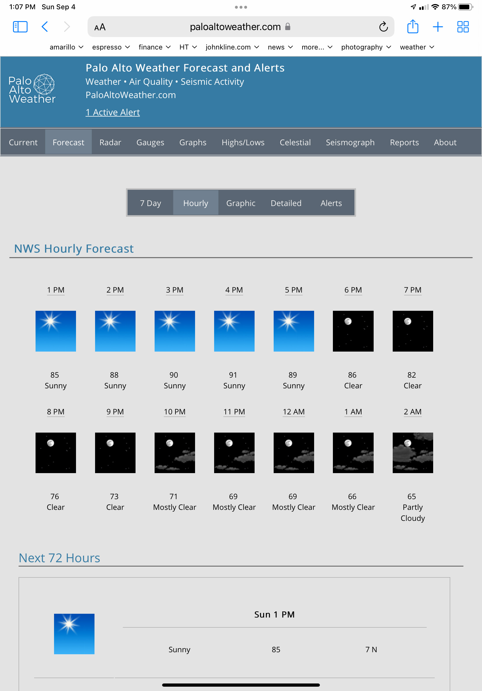

# weewx-nws
*Open source plugin for WeeWX software.

## Description

A WeeWX extension for NWS forecasts.

Copyright (C)2020-2021 by John A Kline (john@johnkline.com)

**THIS PLUGIN REQUIRES PYTHON 3 AND WEEWX 4**

# Installation Instructions

1. Install dateutil for python3 (it is required by the nws extension).
   On debian, this can be accomplished with:
   ```
   sudo apt install python3-dateutil
   ```

1. Download weewx-nws-1.4.zip from the [github](https://github.com/chaunceygardiner/weewx-nws).

1. Run the following command.
   ```
   sudo /home/weewx/bin/wee_extension --install weewx-nws-1.1.zip
   ```
   Note: The above command assumes a WeeWX installation of `/home/weewx`.
         Adjust the command as necessary.

# Configuring weewx-nws

1. weewx-nws is designed to work with no configuration, but it is best to update the
   user agent being used to contact NWS.  This is per NWS rules about using the API.
   To do that, edit weewx.conf and fill in User-Agent with your weather site and contact
   information.
   ```
   [NWS]
       User-Agent = "(my-weather-site.com, me@my-weather-site.com)"
   ```

1. Best pratice is to let weewx-nws pick up your station's latitude an longtitude from
   the Station section in weewx.conf.  If one has a need to override the lat/long, it
   can be set in the NWS section as follows:
   ```
   [NWS]
       latitude = 37.431995  # Best practice is not to set latitude here.
       longitude = -122.333  # Best practice is not to set longitude here.
   ```

1. If NWS is returning the wrong grid for your lat/long (as is the case for the author),
   the twelve hour and one hour forecast URLs can be hardcoded with the correct grid
   with the `one_hour_forecast_url` and `twelve_hour_forecast_url` entries as follows:
   ```
   [NWS]
       twelve_hour_forecast_url = "https://api.weather.gov/gridpoints/MTR/91,87/forecast"
       one_hour_forecast_url = "https://api.weather.gov/gridpoints/MTR/91,87/forecast/hourly"
   ```

1. By default, nws will keep 90 days of forecasts.  One can change this in weewx.conf.
   Set days_to_keep to zero to keep all forecasts.
   Note: Alerts are deleted when they expire.  As such, days_to_keep has no affect on alerts.
   ```
   [NWS]
    days_to_keep = 90  # Set to zero to never delete any forecasts and alerts.
   ```

1. Add NWSForecastVariables to each report that you want to have access to forecasts and alerts.

   For example, to enable in the SeasonsReport, edit weewx.conf to add user.nws.NWSForecastVariables
   in search_list_extensions.  Note: you might need to add both the CheetahGenerator line and the
   search_list_extensions line (if they do no already exist).
   ```
    [StdReport]
        [[SeasonsReport]]
            [[[CheetahGenerator]]]
                search_list_extensions = user.nws.NWSForecastVariables
   ```

1. Restart WeeWX.

1. After the next reporting cycle, navigate to <weewx-html-directory>/nws to see forecasts in the sample report.

1.  To get twelve-hour forecasts (in this example, all forecasts are returned (usually 13, 6.5 days)
    ```
     #for $twelve_hour in $nwsforecast.twelve_hour_forecasts()  # twelve_hour_forecasts(4) will return 4 forecasts.
         $twelve_hour.generatedTime
         $twelve_hour.number
         $twelve_hour.name
         $twelve_hour.startTime
         $twelve_hour.endTime
         $twelve_hour.isDaytime
         $twelve_hour.outTemp
         $twelve_hour.outTempTrend
         $twelve_hour.windSpeed
         $twelve_hour.windDir
         $twelve_hour.iconUrl
         $twelve_hour.shortForecast
         $twelve_hour.detailedForecast
         $twelve_hour.latitude    # Latitude of point for which forecasts were requested
         $twelve_hour.longitude   # Longitude of point for which forecasts were requested
     #end for
    ```
    Sample values for the above variables follow:
    ```
    $twelve_hour.gneratedTime    : 2020-06-08 15:25:13 PDT (1591655113)
    $twelve_hour.number          : 14
    $twelve_hour.name            : Sunday Night
    $twelve_hour.startTime       : 2020-06-14 18:00:00 PDT (1592182800)
    $twelve_hour.endTime         : 2020-06-15 06:00:00 PDT (1592226000)
    $twelve_hour.isDaytime       : 0
    $twelve_hour.outTemp         : 58.000000
    $twelve_hour.outTempTrend    : None
    $twelve_hour.windSpeed       : 2.000000
    $twelve_hour.windDir         : 292.500000
    $twelve_hour.iconUrl         : https://api.weather.gov/icons/land/night/few?size=medium
    $twelve_hour.shortForecast   : Mostly Clear
    $twelve_hour.detailedForecast: Mostly clear, with a low around 58.
    $twelve_hour.latitude        : 37.431495
    $twelve_hour.longitude       : -122.110937
    ```
    Twelve-hour forecasts can be seen in action on the **7 Day** tab at [www.paloaltoweather.com/forecast.html](https://www.paloaltoweather.com/forecast.html).
    The code for this page (at the time of this writing) is:
    ```
       #for $twelve_hour in $nwsforecast.twelve_hour_forecasts()
       <tr>
         <td>
           <table style='width:100%;border-bottom:1pt solid LightGray;padding:15px;'>
             #set icon = $twelve_hour.iconUrl
             #if $target_display == 'smartphone':
               ## Change ?size=medium to ?size=large
               #set icon = $icon.replace('?size=medium', '?size=large')
             #end if
             <td style='width:16%;'></td>
             <td style='width:30%;'>
               <table style='width:100%;text-align:center;'>
                 <tr style='width:100%;'><td>Temp</td></tr>
                 <tr style='width:100%;'><td>$twelve_hour.outTemp $twelve_hour.outTempTrend </td></tr>
                 <tr style='width:100%;'><td>Wind</td></tr>
                 <tr style='width:100%;'><td>$twelve_hour.windSpeed $twelve_hour.windDir.ordinal_compass</td></tr>
               </table>
             </td>
             <td style='width:54%;'>
               <table style='width:100%;text-align:center;'>
                 <tr style='width:100%;'><td style='text-align:center;font-size:$title_font_size;font-weight:bold;border-bottom:1pt solid LightGray;'>$twelve_hour.name</td></tr>
                 <tr style='width:100%;'><td>$twelve_hour.detailedForecast</td></tr>
               </table>
             </td>
           </table>
         </td>
       </tr>
       #end for
    ```
    A screenshot follows:

    

1.  To get one-hour forecasts (in this example, up to 156 foreecasts are returned (6.5 days worth).
    ```
    #for $hour in $nwsforecast.one_hour_forecasts() # Note: one_hour_forecasts(24) will return 24 forecassts (1 day).
         $hour.generatedTime
         $hour.number
         $hour.name             ## Empty for one_hour_forecasts
         $hour.startTime
         $hour.endTime
         $hour.isDaytime
         $hour.outTemp
         $hour.outTempTrend
         $hour.windSpeed
         $hour.windDir
         $hour.iconUrl
         $hour.shortForecast
         $hour.detailedForecast ## Empty for one_hour_forecasts
         $hour.latitude    # Latitude of point for which forecasts were requested
         $hour.longitude   # Longitude of point for which forecasts were requested
    #end for
    ```
    Sample values for the above variables follow:
    ```
    $hour.dateTime        : 2020-06-09 04:30:00 PDT (1591702200)
    $hour.interval        : 60
    $hour.latitude        : 37.431495
    $hour.longitude       : -122.110937
    $hour.usUnits         : 1
    $hour.gneratedTime    : 2020-06-09 04:01:35 PDT (1591700495)
    $hour.number          : 156
    $hour.name            :
    $hour.startTime       : 2020-06-15 15:00:00 PDT (1592258400)
    $hour.endTime         : 2020-06-15 16:00:00 PDT (1592262000)
    $hour.isDaytime       : 1
    $hour.outTemp         : 81.000000
    $hour.outTempTrend    : None
    $hour.windSpeed       : 10.000000
    $hour.windDir         : 292.500000
    $hour.iconUrl         : https://api.weather.gov/icons/land/day/few?size=small
    $hour.shortForecast   : Sunny
    $hour.detailedForecast:
    $hour.latitude        : 37.431495
    $hour.longitude       : -122.110937
    ```
    One-hour forecasts can be seen in action on the **Hourly** tab at [www.paloaltoweather.com/forecast.html](https://www.paloaltoweather.com/forecast.html).
    The code for this page (at the time of this writing) is:
    ```
       #for $hour in $nwsforecast.one_hour_forecasts(72)
       <tr class='forecast_hours'>
         #set icon = $hour.iconUrl
         #if $target_display == 'smartphone':
           ## Change ?size=small to ?size=medium
           #set icon = $icon.replace('?size=small', '?size=medium')
         #end if
         <td></td>
         <td>$hour.startTime.format('%a %l %p')</td>
         <td>$hour.shortForecast</td>
         <td>$hour.outTemp</td>
         <td>$hour.windSpeed $hour.windDir.ordinal_compass</td>
       </tr>
       #end for
    ```
    A screenshot follows:

    

1.  To all alerts for the station's location:
    ```
    #for $alert in $nwsforecast.alerts()
         $alert.effective   # Time issued
         $alert.onset       # Time it will begin
         $alert.ends        # Time it will end
         $alert.event       # Name of event (e.g., Heat Advisory)
         $alert.headline    # Headline
         $alert.description # Long description
         $alert.latitude    # Latitude of point for which alerts were requested
         $alert.longitude   # Longitude of point for which alerts were requested
    #end for
    ```
    Sample values for the above variables follow:
    ```
    effective  : 2020-06-11 09:12:00 PDT (1591891920)
    onset      : 2020-06-11 09:12:00 PDT (1591891920)
    ends       : 2020-06-11 10:12:00 PDT (1591895520)
    event      : Tsunami Warning
    headline   : TEST Tsunami Warning issued June 11 at 9:12AM PDT until June 11 at 10:12AM PDT by NWS National Tsunami Warning Center
    description: PZZ530...THIS_MESSAGE_IS_FOR_TEST_PURPOSES_ONLY...THIS IS A TEST TO DETERMINE TRANSMISSION TIMES INVOLVED IN THE...
    latitude   : 37.431495
    longitude  : -122.110937
    ```
    Alerts can be seen in action on the **Alerts** tab at [www.paloaltoweather.com/forecast.html](https://www.paloaltoweather.com/forecast.html).
    The code for this page (at the time of this writing) is:
    ```
       #set alert_count = 0
       #for alert in $nwsforecast.alerts()
       #set alert_count += 1
       <tr><td style='text-align:left;border-top:1pt solid LightGray;'><br/>Event: $alert.event</td></tr>
       <tr><td style='text-align:left;'>Issued: $alert.effective</td></tr>
       <tr><td style='text-align:left;'>Onset: $alert.onset</td></tr>
       <tr><td style='text-align:left;border-bottom:1pt solid LightGray'>Ends: $alert.ends<br/><br/></td></tr>
       <tr style='width:100%;'><td style='text-align:center;font-size:$title_font_size;font-weight:bold;border-bottom:1pt solid LightGray;'>$alert.headline</td></tr>
       #set desc = $alert.description.replace('\n', '<br/>')
       <tr>
         <td style='text-align:left;'>
           <br/>
           $desc
         </td>
       </tr>
       #end for
    ```
    A screenshot follows:

    

1.  alert_count() is a convenience function to get the number of active alerts
    that apply to your station.  The code to show an active alert count follows:
    ```
       #set alert_count = $nwsforecast.alert_count()
       #if $alert_count > 0
         #if $alert_count == 1
           #set alert_word = 'Alert'
         #else
           #set alert_word = 'Alerts'
         #end if
         <p><a href='forecast.html?tab=alerts' style='font-size:19px;color:black;text-decoration:underline;'>$alert_count Active $alert_word</a></p>
       #end if
    ```

## Troubleshooting

1.  Did you forget to add NWSForecastVariables to your report in weewx.conf?  See step 1 in the **How to access NWS Forecasts in reports.** section.

1.  The extension can be run from the command line to test:

    1. To test requesting forecasts from NWS:
       ```
       PYTHONPATH=/home/weewx/bin python3 /home/weewx/bin/user/nws.py --test-requester --type TWELVE_HOUR --latitude 38.8977 --longitude -77.0365

    1. To test the service as a whole, requesting and saving to a [temporary] sqlite database:
       ```
       PYTHONPATH=/home/weewx/bin python3 /home/weewx/bin/user/nws.py --test-service --latitude 38.8977 --longitude -77.0365
       ```

    1. To view the latest forecast records in the databse (only works for sqlite databases):
       ```
       PYTHONPATH=/home/weewx/bin python3 /home/weewx/bin/user/nws.py --view-forecasts --type ONE_HOUR --nws-database /home/weewx/archive/nws.sdb --view-criterion LATEST --latitude 38.8977 --longitude -77.0365

    1. To view all forecast records in the databse (only works for sqlite databases):
       ```
       PYTHONPATH=/home/weewx/bin python3 /home/weewx/bin/user/nws.py --view-forecasts --type TWELVE_HOUR --nws-database /home/weewx/archive/nws.sdb --view-criterion ALL --latitude 38.8977 --longitude -77.0365
       ```
       ```

    1. To view a summary of forecasts in the database (time inserted, time generated, start/end of forecast) (only works for sqlite databases):
       ```
       PYTHONPATH=/home/weewx/bin python3 /home/weewx/bin/user/nws.py --view-forecasts --type ONE_HOUR --nws-database /home/weewx/archive/nws.sdb --view-criterion SUMMARY --latitude 38.8977 --longitude -77.0365
       ```
       ```
       PYTHONPATH=/home/weewx/bin python3 /home/weewx/bin/user/nws.py --view-forecasts --type TWELVE_HOUR --nws-database /home/weewx/archive/nws.sdb --view-criterion SUMMARY --latitude 38.8977 --longitude -77.0365
       ```

    1. To see all options:
       ```
       PYTHONPATH=/home/weewx/bin python3 /home/weewx/bin/user/nws.py --help
       ```

## Licensing

weewx-purple is licensed under the GNU Public License v3.
