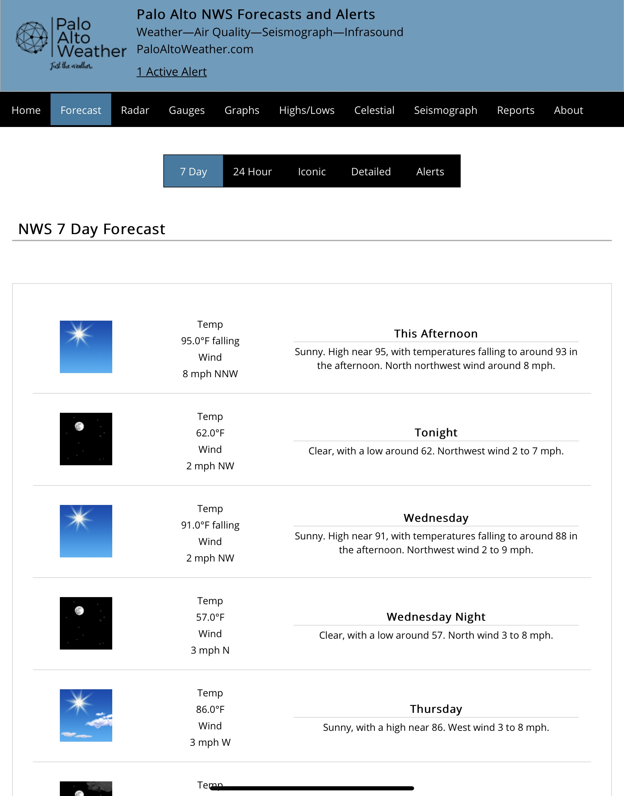
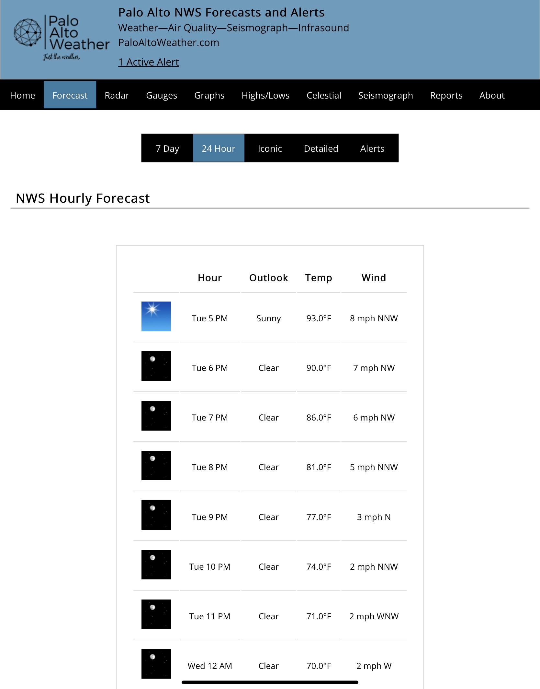
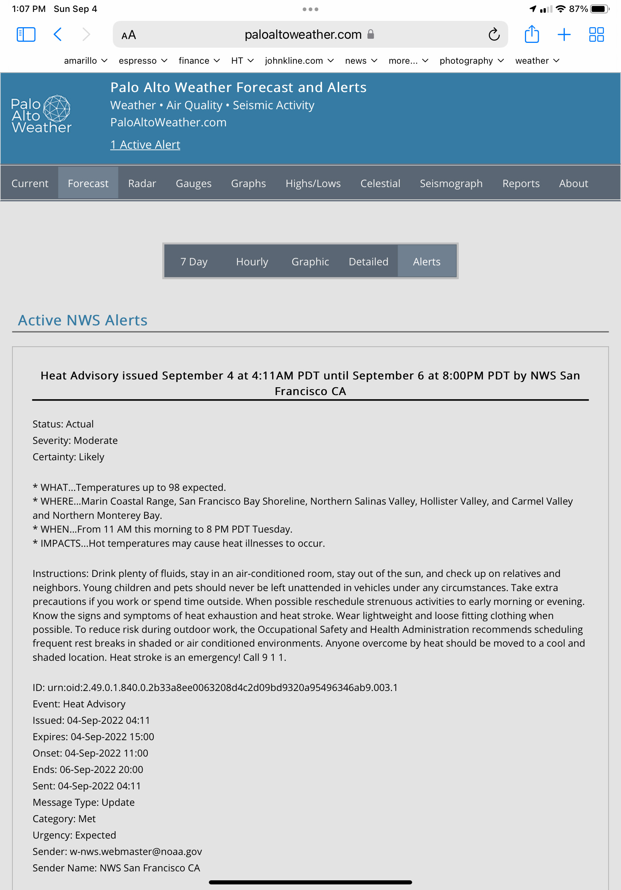

# weewx-nws
*Open source plugin for WeeWX software.

## Description

A WeeWX extension for NWS forecasts.

Copyright (C)2020 by John A Kline (john@johnkline.com)

**THIS PLUGIN REQUIRES PYTHON 3 AND WEEWX 4**

# Installation Instructions

1. Download weewx-nws-master.zip from the https://github.com/chaunceygardiner/weewx-nws page.

1. Run the following command.
   ```
   sudo /home/weewx/bin/wee_extension --install weewx-nws-master.zip
   ```
   Note: The above command assumes a WeeWX installation of `/home/weewx`.
         Adjust the command as necessary.

# Configuring weewx-nws

1. weewx-nws is designed to work with no configuration, but it is best to update the
   user agent being used to contact NWS.  This is per NWS rules about using the API.
   To do that, edit weewx.conf and fill in User-Agent with your weather site and contact
   information.
   ```
   [NWS]
       User-Agent: '(my-weather-site.com, me@my-weather-site.com)'
   ```

1. Best pratice is to let weewx-nws pick up your station's latitude an longtitude from
   the Station section in weewx.conf.  If one has a need to override the lat/long, it
   can be set in the NWS section as follows:
   ```
   [NWS]
       latitude = 37.431995  # Best practice is not to set latitude here.
       longitude = -122.333  # Best practice is not to set longitude here.
   ```

1. Add NWSForecastVariables to each report that you want to have access to forecasts and alerts.

   For example, to enable in the SeasonsReport, edit weewx.conf to add user.nws.NWSForecastVariables
   in search_list_extensions.  Note: you might need to add both the CheetahGenerator line and the
   search_list_extensions line (if they do no already exist).
   ```
    [StdReport]
        [[SeasonsReport]]
            [[[CheetahGenerator]]]
                search_list_extensions = user.nws.NWSForecastVariables
   ```

1. Restart WeeWX.

1.  To get daily forecasts (in this example, all 14 (7 days * 2 per day) forecasts are returned.
    Note: Although called daily forecasts, these are 12 hour forecasts.
    ```
     #for $day in $nwsforecast.daily_forecasts()  # daily_forecasts(4) will return 4 forecasts (2 days).
         $day.generatedTime
         $day.number
         $day.name
         $day.startTime
         $day.endTime
         $day.isDaytime
         $day.outTemp
         $day.outTempTrend
         $day.windSpeed
         $day.windDir
         $day.iconUrl
         $day.shortForecast
         $day.detailedForecast
     #end for
    ```
    Daily forecasts can be seen in action on the **7 Day** tab at [www.paloaltoweather.com/forecast.html](https://www.paloaltoweather.com/forecast.html).
    The code for this page (at the time of this writing) is:
    ```
       #for $day in $nwsforecast.daily_forecasts()
       <tr>
         <td>
           <table style='width:100%;border-bottom:1pt solid LightGray;padding:15px;'>
             #set icon = $day.iconUrl
             #if $target_display == 'smartphone':
               ## Change ?size=medium to ?size=large
               #set icon = $icon.replace('?size=medium', '?size=large')
             #end if
             <td style='width:16%;'></td>
             <td style='width:30%;'>
               <table style='width:100%;text-align:center;'>
                 <tr style='width:100%;'><td>Temp</td></tr>
                 <tr style='width:100%;'><td>$day.outTemp $day.outTempTrend </td></tr>
                 <tr style='width:100%;'><td>Wind</td></tr>
                 <tr style='width:100%;'><td>$day.windSpeed $day.windDir.ordinal_compass</td></tr>
               </table>
             </td>
             <td style='width:54%;'>
               <table style='width:100%;text-align:center;'>
                 <tr style='width:100%;'><td style='text-align:center;font-size:$title_font_size;font-weight:bold;border-bottom:1pt solid LightGray;'>$day.name</td></tr>
                 <tr style='width:100%;'><td>$day.detailedForecast</td></tr>
               </table>
             </td>
           </table>
         </td>
       </tr>
       #end for
    ```
    A screenshot follows:

    

1.  To get hourly forecasts (in this example, 168 (7 * 24) foreecasts are returned.
    ```
    #for $hour in $nwsforecast.hourly_forecasts() # Note: hourly_forecasts(24) will return 24 forecassts (1 day).
        $hour.generatedTime
        $hour.number
        $hour.name
        $hour.startTime
        $hour.endTime
        $hour.isDaytime
        $hour.outTemp
        $hour.outTempTrend
        $hour.windSpeed
        $hour.windDir
        $hour.iconUrl
        $hour.shortForecast
        $hour.detailedForecast
    #end for
    ```
    Hourly forecasts can be seen in action on the **24 Hour** tab at [www.paloaltoweather.com/forecast.html](https://www.paloaltoweather.com/forecast.html).
    The code for this page (at the time of this writing) is:
    ```
       #for $hour in $nwsforecast.hourly_forecasts(24)
       <tr class='forecast_hours'>
         #set icon = $hour.iconUrl
         #if $target_display == 'smartphone':
           ## Change ?size=small to ?size=medium
           #set icon = $icon.replace('?size=small', '?size=medium')
         #end if
         <td></td>
         <td>$hour.startTime.format('%a %l %p')</td>
         <td>$hour.shortForecast</td>
         <td>$hour.outTemp</td>
         <td>$hour.windSpeed $hour.windDir.ordinal_compass</td>
       </tr>
       #end for
    ```
    A screenshot follows:
 
    

1.  To get all alerts for the station's location:
    ```
    #for $alert in $nwsforecast.alerts()
        $alert.effective   # Time issued
        $alert.onset       # Time it will begin
        $alert.ends        # Time it will end
        $alert.event       # Name of event (e.g., Heat Advisory)
        $alert.headline    # Headline
        $alert.description # Long description
    #end for
    ```
    Alerts can be seen in action on the **Alerts** tab at [www.paloaltoweather.com/forecast.html](https://www.paloaltoweather.com/forecast.html).
    The code for this page (at the time of this writing) is:
    ```
       #set alert_count = 0
       #for alert in $nwsforecast.alerts()
       #set alert_count += 1
       <tr><td style='text-align:left;border-top:1pt solid LightGray;'><br/>Event: $alert.event</td></tr>
       <tr><td style='text-align:left;'>Issued: $alert.effective</td></tr>
       <tr><td style='text-align:left;'>Onset: $alert.onset</td></tr>
       <tr><td style='text-align:left;border-bottom:1pt solid LightGray'>Ends: $alert.ends<br/><br/></td></tr>
       <tr style='width:100%;'><td style='text-align:center;font-size:$title_font_size;font-weight:bold;border-bottom:1pt solid LightGray;'>$alert.headline</td></tr>
       #set desc = $alert.description.replace('\n', '<br/>')
       <tr>
         <td style='text-align:left;'>
           <br/>
           $desc
         </td>
       </tr>
       #end for
    ```
    A screenshot follows:
 
    

1.  alert_count() is a convenience function to get the number of active alerts
    that apply to your station.  The code to show an active alert count follows:
    ```
       #set alert_count = $nwsforecast.alert_count()
       #if $alert_count > 0
         #if $alert_count == 1
           #set alert_word = 'Alert'
         #else
           #set alert_word = 'Alerts'
         #end if
                 <table class="lastupdate" style="padding:10px;font-size:19px;color:red;background-color:black;">
                   <tr><td>$alert_count Active $alert_word in Forecast>Alerts</td></tr>
                 </table>
       #end if
    ```

## Troubleshooting

Did you forget to add NWSForecastVariables to your report in weewx.conf?  See step 1 in the **How to access NWS Forecasts in reports.** section.

## Licensing

weewx-purple is licensed under the GNU Public License v3.
