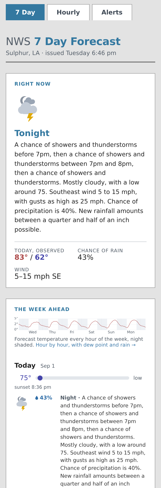
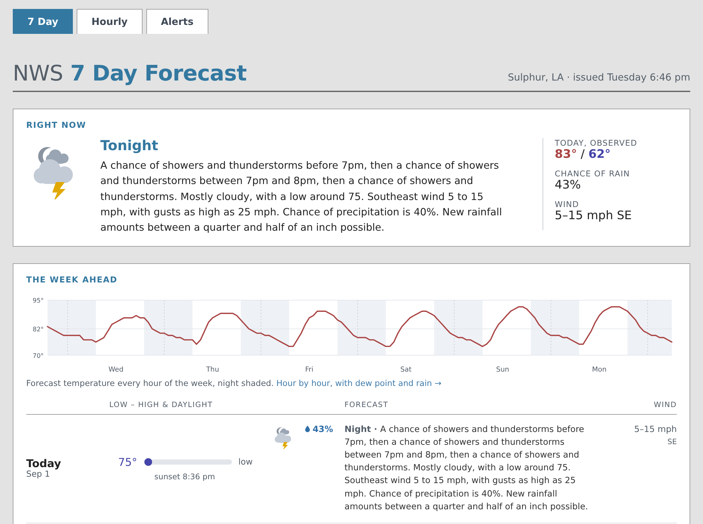
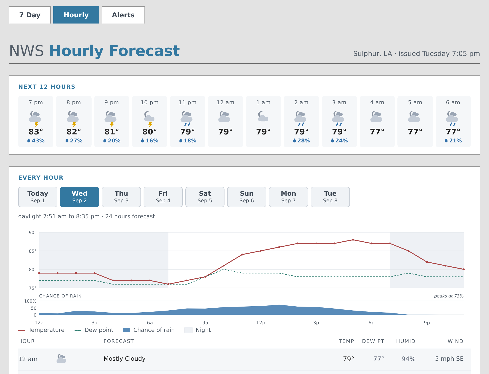
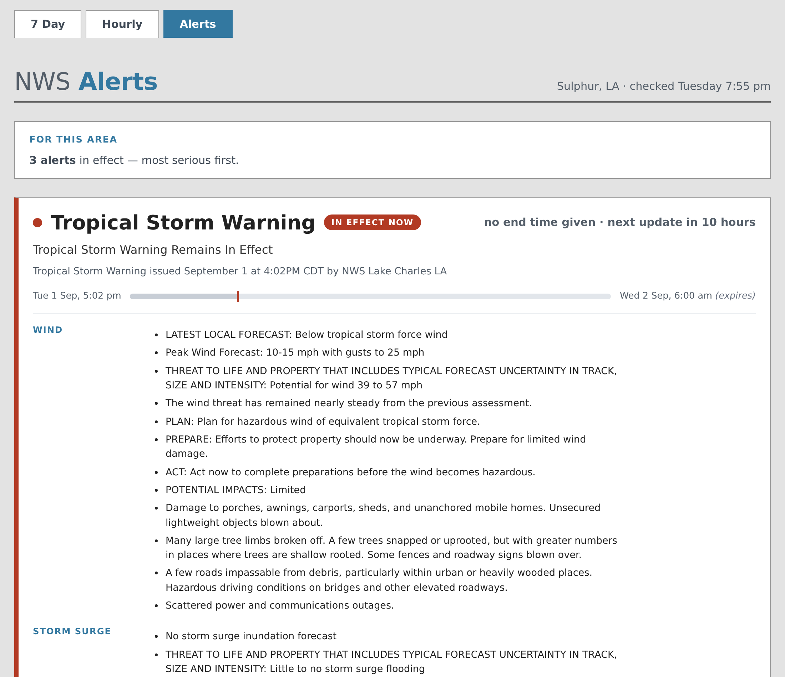
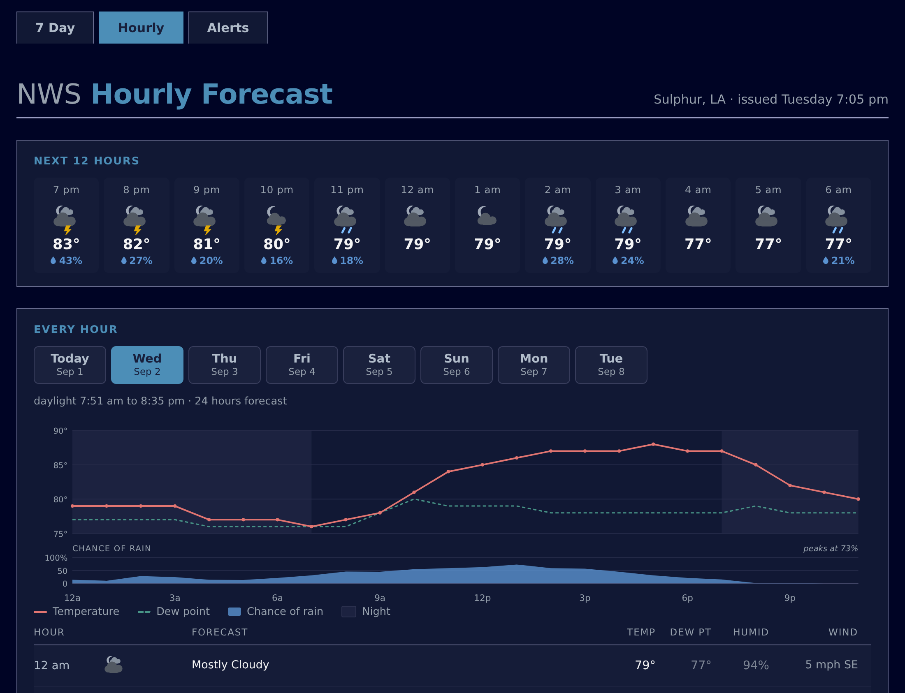

# The sample report

[weewx-nws manual](https://chaunceygardiner.github.io/weewx-nws/) ·
[weewx-nws on GitHub](https://github.com/chaunceygardiner/weewx-nws) ·
[Report an issue](https://github.com/chaunceygardiner/weewx-nws/issues)

---

Installing weewx-nws installs a report as well as the tags.  It publishes three pages to
`<HTML_ROOT>/nws/` and needs no configuration: forecasts appear on your site at the first
report cycle after the install.  It is meant to be useful as it stands and to be read as
worked examples — every page below is rendered and checked on every release.

The pages are responsive, so one page serves a phone and a desktop — there is no second
mobile skin to keep in step — and they follow your reader's own light or dark setting.



The pages fetch nothing: no request goes to api.weather.gov, no font or script is loaded
from anywhere else, and the page does not reload itself.

## The seven-day page

`index.html` — NWS's twelve-hour periods.  A **Right now** card leads with the current
period's icon and forecast beside your station's own observed high and low for today.
Below it, a sparkline of the whole week's temperature with night shaded, then one row per
**calendar day**: the day's low-to-high bar positioned across the week's range, its
daylight hours, and each of that day's periods as a line carrying the icon, the chance of
rain, NWS's own sentence, and the wind.



## The hourly page

`hours.html` — NWS's one-hour periods, about 156 of them.  A strip across the top gives
the next twelve hours at a glance.  Below it, one tab per calendar day, each carrying that
day's chart — temperature, dew point and the chance of rain — and its hour table, with
temperature, dew point, humidity and wind.  At the foot, the whole week as one curve, for
the trend rather than the detail.

Point at a chart, or drag a finger across it, to read any hour.  A chart is also
reachable by Tab: the arrow keys then walk it hour by hour, Shift with an arrow
moves six at a time, Home and End jump to the ends, and Escape clears the reading.



## The alerts page

`alerts.html` — every active NWS alert for the station's location, in effect first and
then most serious first.  Each alert is a card with a severity-colored rail, a status
badge, a bar showing where now falls between the alert's onset and its end, the
description's own sections as real structure, and any instructions called out.



Most of the time there are no alerts, and the page says so plainly rather than showing an
empty list.

{: .note }
The two states are entirely different markup, which is worth knowing if you edit the page:
a change tested on a quiet day has not been tested at all on the branch that matters.  The
repository's `tests/validate_skin_html.py` renders both.

## Light and dark



The pages follow `prefers-color-scheme` — the appearance setting on the reader's own
device, which most phones and laptops expose as Light, Dark or Auto.  A reader whose
device switches at sunset gets a dark page at *their* sunset; one who has chosen light
gets light all day.  There is deliberately **no theme toggle**: a toggle needs javascript,
storage and a visible control, and everyone who copied this skin would inherit a widget
they might not want.

Every color on the page is a custom property, so a copy of the skin can restyle any part
of it by redefining a property rather than by editing rules.  The dark values are derived
rather than picked — each color reproduces its light counterpart's prominence against
whatever ground it actually sits on — and both palettes are checked on every release by
`tests/test_nws_css.py`.

The `--fc-*` properties this skin defines are its own and may change between releases.
The `--wx-*` properties that color the icons are a contract and will not; see
[Drawn icons](recipes.md#drawn-icons).

## What is installed, and where

| File | What it is |
|---|---|
| `skins/nws/index.html.tmpl` | The seven-day page |
| `skins/nws/hours.html.tmpl` | The hourly page |
| `skins/nws/alerts.html.tmpl` | The alerts page |
| `skins/nws/menubar.inc` | The three-tab navigation shared by all three |
| `skins/nws/css/nws.css` | The stylesheet, including the dark palette |
| `skins/nws/scripts/nws.js` | The day tabs, the chart crosshair, and the alert times |
| `skins/nws/skin.conf` | The skin's own configuration |

`skin.conf` names two search list extensions and generates the three pages:

```ini
[CheetahGenerator]
    search_list_extensions = user.nws.NWSForecastVariables, user.nwsskin.NWSSkin
    [[ToDate]]
        [[[days]]]
            template = index.html.tmpl
        [[[hours]]]
            template = hours.html.tmpl
        [[[alerts]]]
            template = alerts.html.tmpl

[CopyGenerator]
    copy_always = css/nws.css, scripts/nws.js

[Generators]
    generator_list = weewx.cheetahgenerator.CheetahGenerator, weewx.reportengine.CopyGenerator
```

The two extensions are different in kind, and the difference matters if you build on this:

- **`user.nws.NWSForecastVariables`** is the `$nwsforecast` tag API — the forecast itself,
  the drawn icons, and the NWS and CAP semantics every skin needs.  It is documented, and
  it is stable.  See [Tags](tags.md).
- **`user.nwsskin.NWSSkin`** is `$nwsskin`: *this* report's charts, chips and alert cards.
  It is presentation, it is not an API, and nothing in it is promised to survive a
  release.  Copy what you like from it; do not depend on it.

`copy_always` rather than `copy_once` is deliberate: the stylesheet and the script change
from release to release, and `copy_once` writes a file only if it is not already there, so
an upgraded skin would go on serving the previous release's css.

The report itself is a stanza in `weewx.conf`:

```ini
[StdReport]
    [[NWSReport]]
        HTML_ROOT = public_html/nws
        enable = true
        skin = nws
```

`weectl` writes that `HTML_ROOT` by prepending your station's own — the installer supplies
just `nws` — so the pages land in a subdirectory of the site rather than on top of it.
Set `enable = false` to stop generating the pages.  The `$nwsforecast` tags go on working:
they are served by the extension, not by this report.

## Making it your own

Edit the templates in place if you like — they are ordinary Cheetah — but remember that
reinstalling the extension overwrites them.  For anything you intend to keep, copy the
skin to a name of your own and point a new report stanza at it:

```
cp -r <SKIN_ROOT>/nws <SKIN_ROOT>/myforecast
```

```ini
[StdReport]
    [[MyForecastReport]]
        HTML_ROOT = forecast
        enable = true
        skin = myforecast
```

[Recipes](recipes.md) has the pieces on their own, ready to paste into a skin you already
have.

## Icons

The sample report **draws** its icons.  The extension carries a drawn SVG symbol for all
34 NWS conditions, day and night; the seven-day and hourly pages emit
`$nwsforecast.icon_sprite` once and then call `$nwsforecast.icon()` per period, so the
pages make no request to api.weather.gov at all and the icons stay crisp at any size.
`css/nws.css` sizes them per context — 96 px on the Right now card, 40 px on a day row, 34
px in the hour table.  See [Drawn icons](recipes.md#drawn-icons) for the tags, the color
properties and the dark palette.

(Through 5.1 the pages hot-linked NWS's hosted images, and the extension separately bundled
NWS's icon set as PNG files that nothing referenced.  Both are gone.)

The condition names, which are the last path segment of an NWS icon URL:

| Name | Condition | Name | Condition |
|---|---|---|---|
| `skc` | Fair/clear | `sleet` | Sleet |
| `few` | A few clouds | `rain` | Rain |
| `sct` | Partly cloudy | `rain_showers` | Rain showers (high cloud cover) |
| `bkn` | Mostly cloudy | `rain_showers_hi` | Rain showers (low cloud cover) |
| `ovc` | Overcast | `tsra` | Thunderstorm (high cloud cover) |
| `wind_skc` | Fair/clear and windy | `tsra_sct` | Thunderstorm (medium cloud cover) |
| `wind_few` | A few clouds and windy | `tsra_hi` | Thunderstorm (low cloud cover) |
| `wind_sct` | Partly cloudy and windy | `tornado` | Tornado |
| `wind_bkn` | Mostly cloudy and windy | `hurricane` | Hurricane conditions |
| `wind_ovc` | Overcast and windy | `tropical_storm` | Tropical storm conditions |
| `snow` | Snow | `dust` | Dust |
| `rain_snow` | Rain/snow | `smoke` | Smoke |
| `rain_sleet` | Rain/sleet | `haze` | Haze |
| `snow_sleet` | Snow/sleet | `hot` | Hot |
| `fzra` | Freezing rain | `cold` | Cold |
| `rain_fzra` | Rain/freezing rain | `blizzard` | Blizzard |
| `snow_fzra` | Freezing rain/snow | `fog` | Fog/mist |

An icon URL can name a precipitation chance (`rain_showers,20`) and can name two conditions
at once (`.../day/tsra_hi,20/rain,20`).  Both resolve to the first condition for the
purpose of picking a file.

{: .note }
The chance in that URL is **not** the same number as the period's `pop` field: NWS rounds
it to a multiple of ten and stores the exact value separately, and measured over a whole
database the two disagree far more often than they agree.  That is why the pages print
`pop` beside the icon rather than the number burned into it, and why `icon_name()` does not
hand the suffix back.
